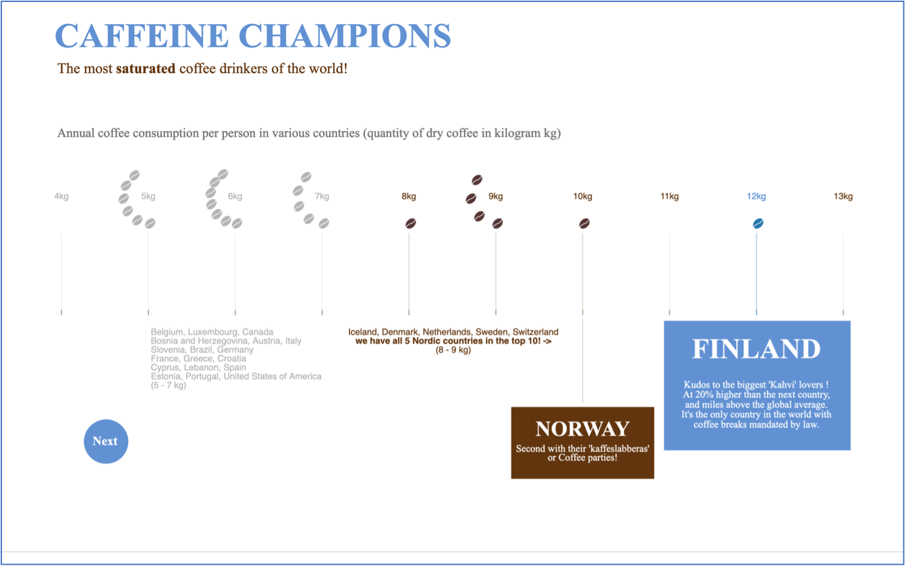
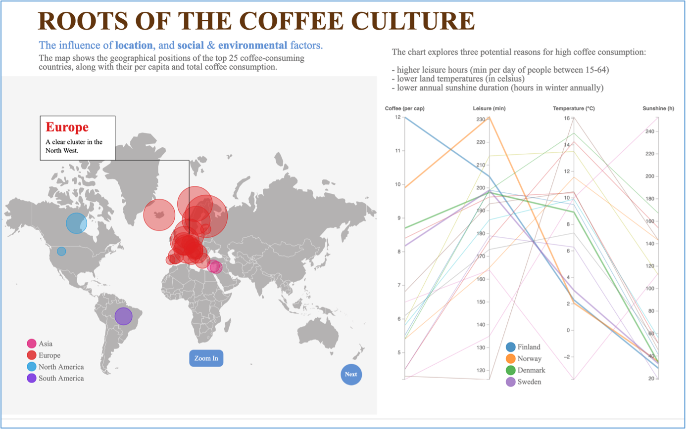
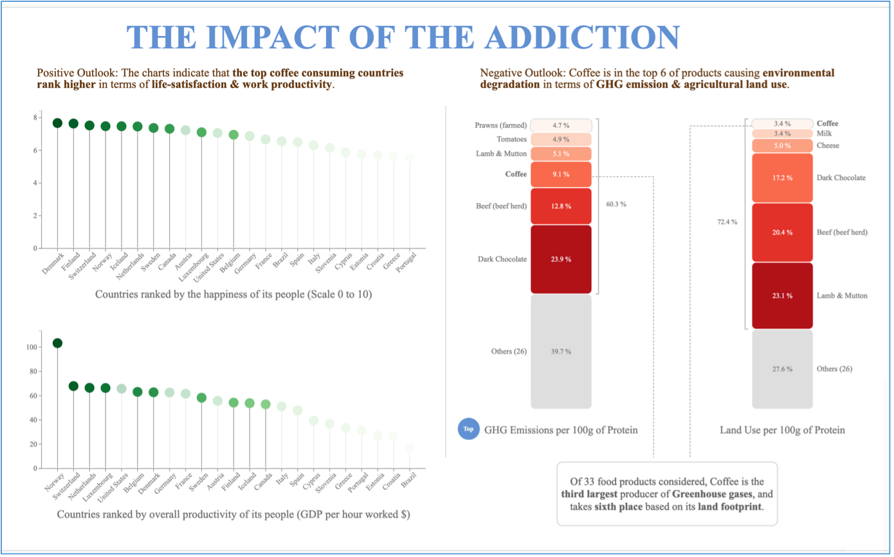
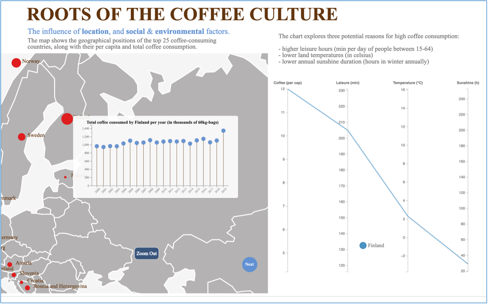
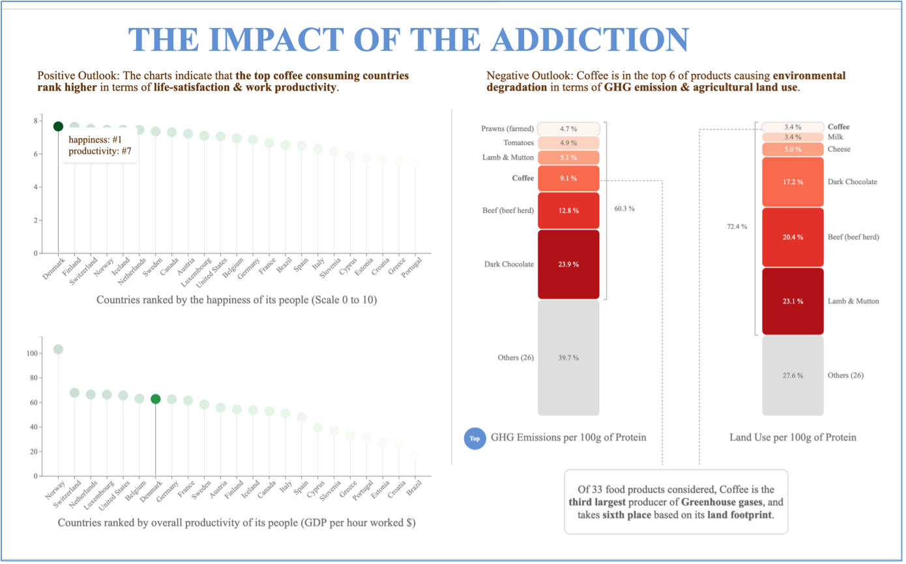

# Coffee Consumption Trends and Impact

### **Please ensure that you cite this repository if you use any of its code.**

## Overview

Coffee is one of the top 5 most popular beverages in the world and it is the second or the most popular hot beverage according to various statistical publications. While this is a generally popular and accepted piece of information, this coursework delves deeper to understand how the popularity of coffee varies across countries with a particular focus on the Nordic Countries (Denmark, Finland, Iceland, Norway, Sweden), the potential reasons behind this coffee culture, and the impact on people and the environment.

### Story

**Theme:** Coffee Consumption Trends and Impact.

The data collected for this theme was analyzed during the exploratory phase, and the key insights uncovered are exposed through explanatory visualizations (Knaflic, 2014).

The story first unveils the countries with an unparalleled coffee addiction and moves on to show the user where in the world the popularity is higher, i.e., whether or not the love for caffeine has a geographical association. Along with this, the visualization focuses on other key parameters which are likely to influence higher levels of coffee consumption, namely, average leisure hours of people, the land temperature, and average sunshine duration for each country. Finally, the story goes on to show the positive and negative effects of coffee intake.

## Visualizations

### Section 1 – The Top Coffee Consumers

**Swarm Plot**
- To draw the attention of the user towards the highest-ranked countries based on their per capita coffee consumption, a creative variant of a swarm plot is used (Heinz, 2020) (Shander, 2022).
- Data points are centered around the amount consumed (in kg).
- Coffee bean images are used instead of standard circles to make the visualization more thematic.
- Content is strategically greyed out to shift the focus towards Finland, Norway, and other Nordic countries which are in the top 10.
- Text annotations are animated to appear gradually, giving the user sufficient time to grasp the content.
- The title and subtitle colors are used in the annotations for the highest and second-highest coffee-consuming countries to help the user immediately associate Finland as the “Caffeine Champion” and Norway as one of the “most saturated coffee drinkers of the world.”
- Text annotations provide interesting facts to add more context to the story.

### Section 2 – Influencing Parameters

This section is divided into two main parts to show the trends and the reasons behind them.

**Map**
- This section depicts how the coffee culture is spread out geographically with the help of a map visualization.
- GeoMercator projection is used for the map, which is familiar to most people, even though it does not provide an accurate indication of the sizes of countries, especially towards the poles.
- Circles represent countries where a larger radius indicates higher per capita intake of coffee.
- Color scheme indicates which continent the countries belong to.
- An animated caption over the cluster on the map calls out Europe and the region, Northwest, which includes the Nordic countries.
- A zoom feature is built into the map to help users see which countries are part of the severely overlapping European cluster. Labels for countries become visible when zoomed in.
- This visualization forms the foundation for the parallel plot because the parameters explored there, such as temperature and sunshine duration, are closely related to the geographical position of a country.

**Lollipop Chart**
- A tooltip is added over the country circles which show the total coffee consumption trend of each country over time from 2000 to 2019 with the help of a lollipop chart.

**Parallel Coordinates Chart**
- The second half of the visualization is a parallel plot or a parallel coordinates chart (Holtz, 2018b) which lets the user explore and understand some of the reasons behind the coffee trend.
- The parallel plot lines for the Nordic countries are highlighted to convey that these top coffee-consuming countries generally have higher leisure hours, lower average temperatures, and lower annual sunshine hours.
- The first parallel coordinate axis shows per capita consumption, placed there purposefully even though it is a repetition to help users easily correlate it with the other parameters.
- Interactivity is added between the map and the parallel coordinates chart. When a user hovers over a circle on the map, only the associated data for that country is retained on the parallel plot, allowing users to explore and understand the influencing parameters individually for each country.

### Section 3 - The Positive and Negative Aspects of Coffee Consumption

This visualization is divided into two main sections to show the positive and negative aspects of coffee consumption. For the positive aspect, a social perspective is chosen, and for the negative, an environmental perspective.

**Lollipop Chart**
- The first half uses a lollipop chart to show the ranking of countries based on two factors generally associated with coffee consumption:
  1. Happiness / life satisfaction
  2. Work productivity
- A green color scheme is chosen to pre-attentively convey to the user that this is a positive aspect.
- Strategic opacity levels directly show the user what the caption of the visualization effectively conveys – i.e., the top coffee-consuming countries rank higher in terms of overall life satisfaction and productivity of their people. This includes the Nordic countries.
- There is bidirectional interactivity between the two lollipop charts where hovering over one circle also highlights the lollipop associated with the same country in the other chart and fades out all the others. This allows the user to see how the same country ranks in terms of both positive parameters.

**Stacked Column Chart**
- The second half uses a stacked column chart (Visual Vocabulary) (Holtz, 2018a) to highlight the negative environmental aspects of coffee intake and how increased consumption can impact the environment through:
  1. Greenhouse gas (GHG) emissions
  2. Agricultural land exploitation
- The rectangles are animated to add a dynamic element to the visualization.
- Text annotations provide insights into how coffee production and supply chains become the third-largest contributor to GHG emissions and the sixth-largest contributor to land footprint.
- A red color palette is used to convey the negative aspects.
- Only the top six contributors are retained in the chart to avoid clutter. The seventh category, “Others,” which includes the contribution of all remaining 26 food products, is greyed out to focus the user’s attention on the relevant sections.

## Chart Choices

1. **Swarm Plot:** Used to show the distribution of per capita coffee consumption across countries. This chart was chosen because it was important to show the value of each data point (Kim, 2022). The visualization is a creative variant closely related to a swarm plot.
2. **Map:** To highlight the geographical placement of the top coffee consumers (spatial visualization), a map visualization is used. The idea was to show that there is a higher concentration in the Northern hemisphere, particularly in Northwest Europe. This sets the context for the parallel plot visualization since parameters like temperature and sunshine duration are tightly bound to a country’s geographical position.
3. **Parallel Coordinates Chart:** Since multiple parameters – leisure hours, land temperature, and annual sunshine hours – are being explored simultaneously to convey how they might influence a country’s coffee culture, a parallel coordinate chart was selected. This chart conveys both ranking and magnitude along multiple variables. The first line shows per capita consumption to ease correlation. For example, it allows users to follow the lines for Finland and Norway, which are emphasized, and deduce that they have higher leisure hours, very low temperatures, and very low annual sunshine, which may be why they top the list of coffee consumers. This insight is conveyed with appropriately color-coded text.
4. **Lollipop Chart:** In the positive facet section, lollipop charts are used to show ranking. This visualization type was chosen because it was important to showcase which countries are the happiest and most productive and if they are the same countries that top the list of caffeine addicts.
5. **Stacked Column Chart:** Instead of showing the actual values of GHG emissions and agricultural land use for each food product, this visualization shows the composition or part-to-whole relationship. Using percentage as a unit, it becomes relatable and allows users to easily deduce that coffee is a significant contributor to both GHG emissions and land footprint.

## Additional Features and Interactivity

- **Swarm Plot Animation:** The swarm plot is animated to gradually show captions that share insights with the user.
- **Map Zoom Feature:** The map includes a zoom feature that allows users to zoom in on the circles depicting per capita consumption of coffee.
- **Dynamic Labels:** Labels on the map become visible when the user is sufficiently zoomed in.
- **Annotations:** Annotations are used in all visualizations to highlight significant insights.
- **Tooltips:** Tooltips have been added wherever appropriate. The tooltip over the country-circles on the map shows the variation in total coffee consumption over a period.
- **Interactivity between Map and Parallel Coordinates Chart:** There is one-sided interactivity between the map and the parallel coordinates chart. Hovering over a country retains the line corresponding to that country on the chart while all others are hidden.

- **Bidirectional Interaction between Lollipop Charts:** There is bidirectional interaction between the two lollipop charts depicting the ranking of countries based on happiness index and labor productivity. Hovering over a lollipop in one chart highlights the lollipop corresponding to that country in both charts and lowers the opacity of all other countries. A guiding tooltip also shows the user the ranks of the country in terms of happiness and productivity.

